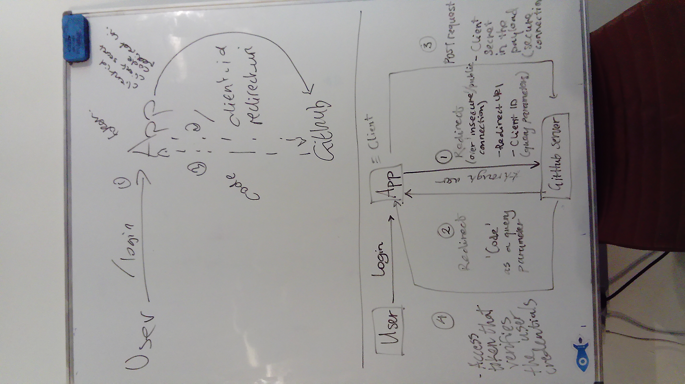

# OAuth Flow (Github example)

  
(From Tuesday evening whiteboard session)

  (From Monday morning walkthrough)

1. Server serves homepage to browser
2. Browser sends client_id & redirect_uri to Github
3. Github sends code back to browser
4. Browser sends code to server
5. Server sends secret, client_id & code to Github
6. Github sends access token to server
7. Server sends request to Github for more info (e.g. username) using the access token
8. Github sends response to server

### *OAuth Project Flow* (by Cleo and Marina)

Login page >  
User is redirected to github >  
Gets permission >  
Is logged in >  
(*Note*: We have token from github but no info on user)  
Make request to github for info on authenticated user ie. username etc >  
Once this is retrieved you have a couple of options:  

1) Throw away the token if you only want to authenticate them

#### Back-end options
  
(From Tuesday evening whiteboard session)

2a) If you want to gain more permissions/actions then put the token inside a JWT and put that inside either a cookie or an http header.  
*Note*: If you put it in a cookie it will automatically come back to you so it will be easy. If you send it in header you have to access it from the header.

2b) (More secure option) Take the users token and store it in the database through postgres for the specific username (GitHub usernames are unique)
