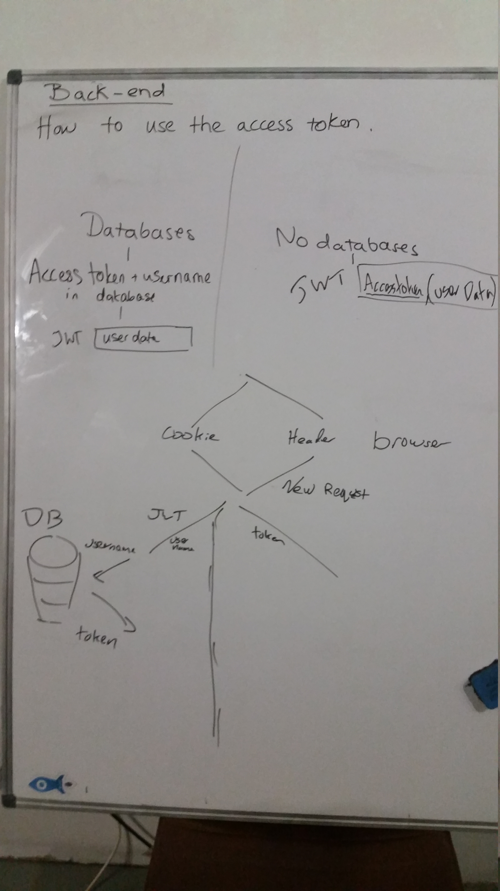

# OAuth Project

## OAuth workflow with project (Github) example

1. Server serves homepage to browser
2. Browser sends client_id & redirect_uri to Github
3. Github sends code back to browser
4. Browser sends code to server
5. Server sends secret, client_id & code to Github
6. Github sends access token to server
7. Server sends request to Github for more info (e.g. username) using the access token (*Note*: Github username is unique)
8. Github sends response to server

## JWT in database or not

### With database
If you want to gain more permissions/actions then put the token inside a JWT and insert that into a cookie or an http header. (*Note*: If you put it in a cookie it will automatically come back to you so it will be easy. If you send it in header you have to access it from the header.)  
- Access token & username into database
- JWT to contain username
- Send request, including JWT (in cookie or authorisation header)
- Get response
- Query database using the username (stored in the JWT)
- Database returns access token

### Without database
(More secure option) Take the users token and store it in the database through postgres for the specific username (GitHub usernames are unique).   
- JWT to contain access token
- Send request, including JWT (in cookie or authorisation header)
- Get response, containing token
