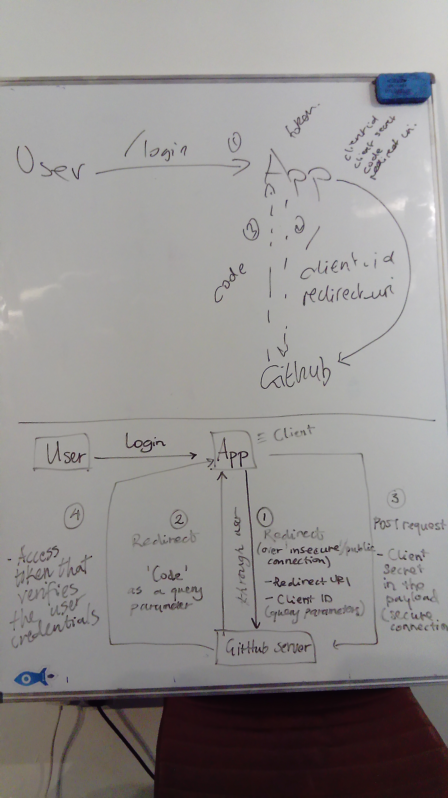

# OAuth Flow (Github example)

1. Server serves homepage to browser
2. Browser sends client_id & redirect_uri to Github
3. Github sends code back to browser
4. Browser sends code to server
5. Server sends secret, client_id & code to Github
6. Github sends access token to server
7. Server sends request to Github for more info (e.g. username) using the access token
8. Github sends response to server

# JWT in database or not

